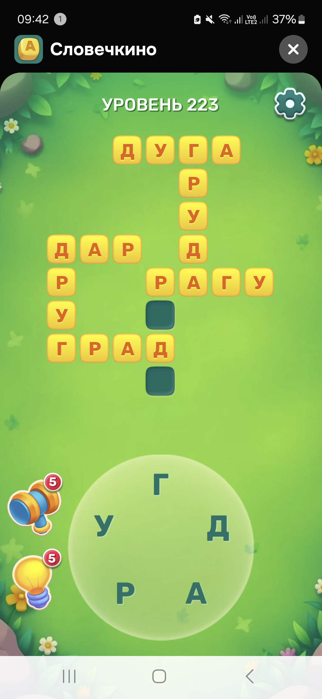
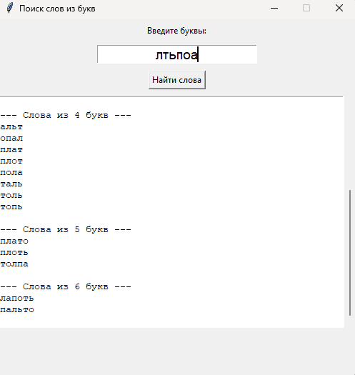
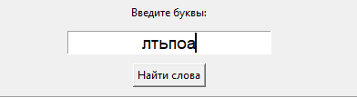
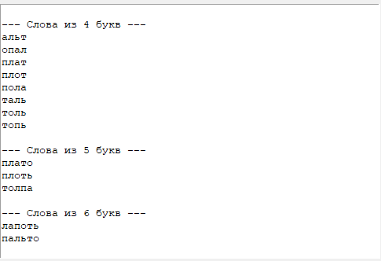

# Поиск слов из букв

Программа на Python с графическим интерфейсом (Tkinter), которая ищет все слова, которые можно составить из заданных букв.  
Используется словарь из файла `nouns.csv` (столбец `bare` с существительными).

## 💡 Зачем нужна эта программа




Эта программа нужна, чтобы проходить уровни в различных играх и приложениях на поиск слов с помощью комбинаций букв.
Другие решения, которые есть в интернете, предлагают ограниченный набор слов, очень часто не находят нужные слова и
постоянно раздражают рекламными вставками. Это решение можно установить на компьютере за минуту и пользоваться
без рекламы, без смс, без подписок и т.д.



## 🛠️ Как работает программа

1. Пользователь вводит буквы
2. Программа перебирает все комбинации слов из введённых букв длиной от 2 до N, введённых букв
3. Выводятся найденные в словаре существительных слова, т.е. реально существующие
4. Результаты выводятся в окне, сгруппированные по длине слова

## ⚙️ Структура программы
'''
slovechkino/
│
├── README.md              # описание проекта
├── requirements.txt       # зависимости
├── main.py                # код программы
└── nouns.csv              # словарь существительных
'''

## 🚀 Как запустить

1. **Клонировать репозиторий:**
   ```
   git clone https://github.com/SlesarADmi93/slovechkino.git
   cd word-finder
   ```
   
2. **Установить зависимости:**
	```
	pip install -r requirements.txt
	```

3. **Запустить программу:**
	Двойной клик по ярлычку python main.py

4. **Ввести буквы:**



5. **Получить результат:**



## 🌱 Развитие проекта

- Оптимизация алгоритма поиска слов
- Добавление функционала запуска слов с помощью кнопки Enter
- Расширение словаря существительных
- Добавление возможности обратной связи с разработчиком внутри приложениях
- Улучшение визуальной составляющей

## 🤝 Контакты для связи с разработчиком
- Телеграм: @SlesarADmi93
- Электронная почта: SlesarADmi93@gmail.com